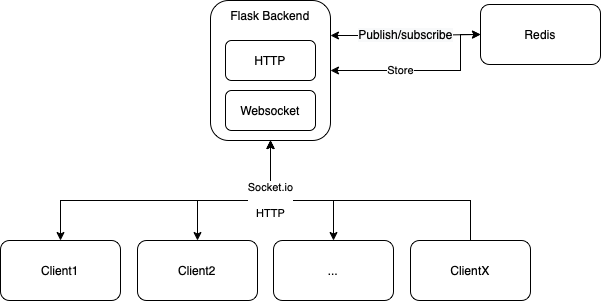

# Coached Conversation Collector 

[](https://github.com/psf/black)

## Installation

To install the framework and its dependencies make sure anaconda distribution is installed and use the following commands:

```shell
conda env update -f environment.yaml
conda activate ccc
```

## Coached Conversation Collector application

The application is built using the Flask framework and a Redis instance. Flask is used to create the backend of the application handling HTTP requests and socket.io events. 
Redis has two roles: first it is a message broker and second it is a storage space (see [authentication](docs/authentication.md)). 
Following is the global architecture of the application:



### Application components

The application has the following components:

1. [Lobby](docs/lobby.md): Here the pariticipants can see the chatrooms and access them depending on their status.
2. [Chatroom](docs/chat.md): Room where the participants perform the task, i.e., have a discussion.
3. [Administrator page](docs/admin.md): Administrator interface with an overview of online users and conversations.

### Start the application

Start Redis instance with append only mode on.

```shell
redis-server --appendonly yes
```

Before starting the application ensure that a Redis instance is up and running.

```shell
gunicorn --worker-class eventlet -w 1 ccc.main:app
```

3 modes can be used to run the application: production, development and testing. The mode needs to be defined in the file [.env](ccc/.env), by default the mode is set to development.

## Conventions

We follow the [IAI Python Style Guide](https://github.com/iai-group/styleguide/tree/main/python).
