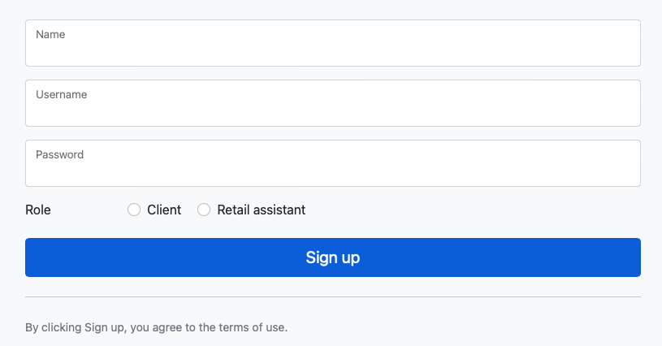

# Authentication

This part of the application is in charge of the authentication of the different users. 

The information of each users are stored in the Redis instance. These information are then used when a user returns to the application. 

## User
A [user](../ccc/app/auth/user.py) has 5 properties:
- An id
- A username
- A name
- A role which can either be client or shopping assistant
- A key to  retrieve information stored in Redis

## Registration / Login

New users need to complete a registration form, if the username already exists for the chosen role an error will appear.

To login a user needs a username, a password, and their role.
The system will check if the information provided match with records in the Redis store.
