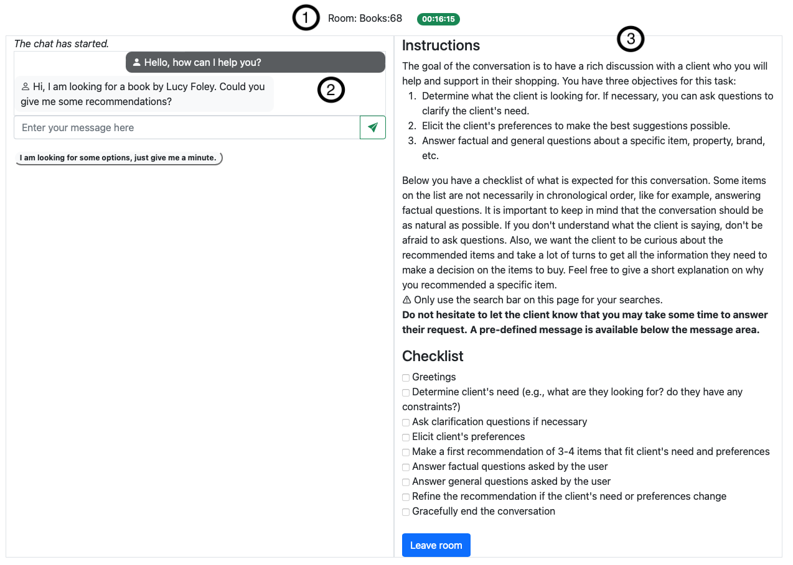
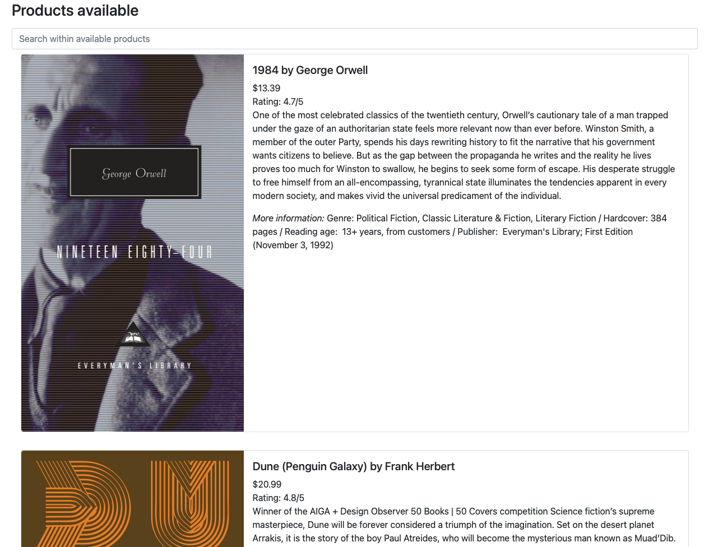
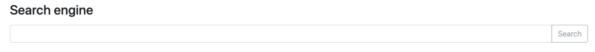

# Chatroom

This component handles the real-time chat feature of the framework. See [Room](../ccc/app/chat/room.py) for the implementation.

When a shopping assistant logs in, chatroom(s) corresponding to their interest(s) will be open for the client to join. The number of participants per chatroom can be limited (by default only 2 participants are allowed), however only one shopping assistant can be in the chatroom. 

## Real-time chat

To build a real-time chat we use [Redis](https://redis.io) as a message broker and [socket.io](https://socket.io) to send and receive the messages in real-time.
Flask acts as a middleman between the clients and Redis. 

Redis keeps the conversation history in-memory unlike socket.io and offloads heavy work from Flask. Therefore, we have a simple and scalable component.

**Note**: socket.io can be unstable and does not save some messages in Redis. Therefore, a back-up solution saving the messages in a file exists (see function [save_message](../ccc/app/chat/chat.py#L202)).

The conversation is limited in time, when the timer elapses all participants are redirected to the lobby. Also, if the shopping assistant is inactive for at least 1min30s, the chatroom is automatically closed and the participants are redirected to the lobby.

## User interface

The interface has several elements depending on the role of the user (i.e., client or shopping assistant).  

The timer (1), the conversation (2), and the instructions (3) elements are common to all users. The timer is placed at the top of the page. After, there are a panel on the left displaying the on-going conversation and another panel on the right that displays the instructions. See the example with the instructions for a shopping assistant below.

The shopping assistant has 2 additional elements: a list of products and an internal search engine.

**Note**: it is necessary to have a collection of indexed documents to be able to use the internal search engine.

