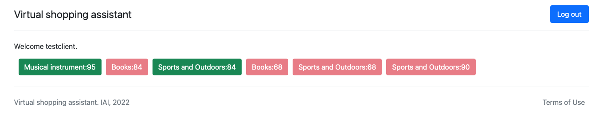

# Lobby

When a user logs in, they will be placed in the lobby where they can see available rooms. 
A shopping assistant will only see the rooms which they controls while a client will see all the rooms available. The status of the rooms will be updated when socket.io events occur like for example if a new shopping assistant logs in or a room is full.

The picture below shows the lobby for a client where the open chatrooms are in green and the occupied ones are in red.

