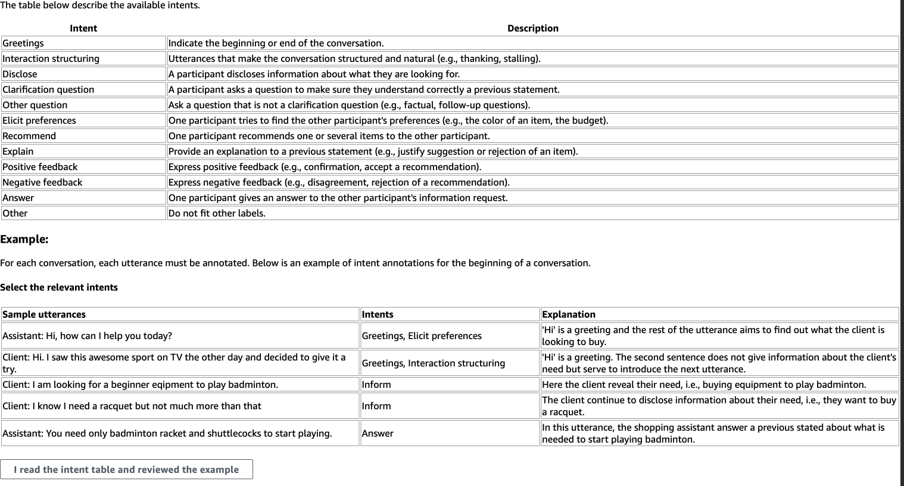
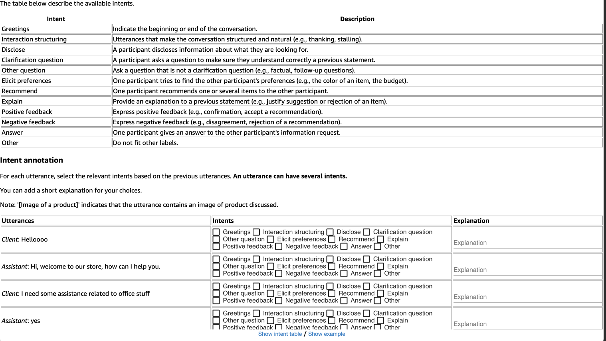

# MG-ShopDial annotation

The utterances of MG-ShopDial are annotated on two different levels: intents and conversational goals.
Please refer to the paper for more details on the annotation schemata and inter-annotator agreement.

## Intent annotation

The annotation is proposed as a Amazon MTurk task. 

### MTurk Task details

The crowd workers recruited have the following characteristics:

  * Location: US based
  * Number of HIT approved: >= 1000
  * HIT Approval rate: >= 95%

For each conversation, 5 crowd workers annotate all utterances and the intents selected by at least two annotators are kept.
In MG-ShopDial, each intent is accompanied with the number of annotators selecting it.

### MTurk Task UI

Before starting the annotation, the crowd worker is shown an example along with the intent description table as below:

For the annotation, the conversation is displayed as a table with 3 columns as follows:

## Conversational goals annotation

The goal annotation is done for every conversation by one author. A test sample with 25% of the conversations is also annotated by 2 crowd workers from Amazon MTurk.

### MTurk Task details

The crowd workers recruited have the following characteristics:

  * Qualification: Master workers
  * Location: US based
  * Number of HIT approved: >= 1000
  * HIT Approval rate: >= 95%

For each conversation, 2 crowd workers annotate all utterances.

### MTurk Task UI

The UI is the same as for intent annotation except that intents have been replaced by conversational goals.
